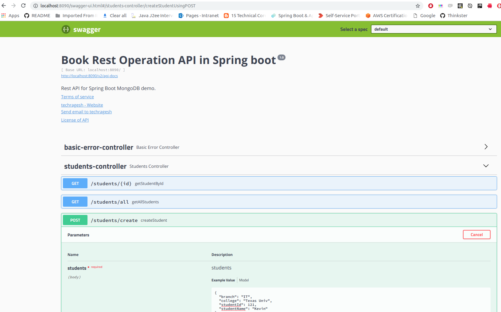
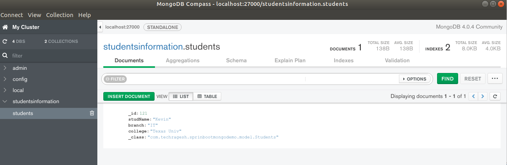

# springboot-mongo-demo
This project explains how to use mongo in springboot with docker

This application explains how to use mongo in springboot along with docker.

### Application demp

This is a simple REST API Application. I have used Swagger which takes the manual work out of API documentation,  with a range of solutions for generating, visualizing, and maintaining API docs.  

Maven dependencies used for mongo, swagger and lombok

```
        <dependency>
            <groupId>org.springframework.boot</groupId>
            <artifactId>spring-boot-starter-data-mongodb</artifactId>
        </dependency>
        
        <dependency>
             <groupId>org.projectlombok</groupId>
             <artifactId>lombok</artifactId>
             <version>1.18.4</version>
             <scope>provided</scope>
        </dependency>
        
        <dependency>
             <groupId>io.springfox</groupId>
             <artifactId>springfox-swagger2</artifactId>
             <version>${springfox-version}</version>
        </dependency>
        <dependency>
             <groupId>io.springfox</groupId>
             <artifactId>springfox-swagger-ui</artifactId>
             <version>${springfox-version}</version>
        </dependency>
        
        <dependency>
             <groupId>com.fasterxml.jackson.core</groupId>
             <artifactId>jackson-core</artifactId>
        </dependency>
      
```

Students.java

```
@Document(collection = "students")
@Data
public class Students {

    @Id
    @Field(value = "_id")
    private Long studentId;

    @Indexed
    @Field(value = "studName")
    private String studentName;

    @Field(value = "branch")
    private String branch;

    @Field(value = "college")
    private String college;
    
}

```

StudentsDao.java

```
@Repository
public interface StudentsDao extends MongoRepository<Students, Long> {

}

```

DockerFile

```
FROM java:8
VOLUME /tmp
ADD target/sprinboot-mongo-demo-0.0.1-SNAPSHOT.jar springboot-mongo-demo.jar
EXPOSE 8090
RUN bash -c 'touch /springboot-mongo-demo.jar'
ENTRYPOINT ["java","-Dspring.data.mongodb.uri=mongodb://mongo/studentsinformation", "-Djava.security.egd=file:/dev/./urandom","-jar","/springboot-mongo-demo.jar"]

```

Do **mvn clean install**

Build the dockerfile by using this command

```
docker build -t springboot-mongo-demo:latest .

```

**Note:** Keep the Dockerfile in the project root directory.


Run the mongo image from docker

```
docker run -d -p 27000:27017 --name mongo mongo

```
**Note:** Here I have used localhost port number as 27000. So mongodb port 27017 from docker will be mapped to this port 27000.
Also, I have named docker images as mongo.

**_How to link docker mongodb to this application_**

```
docker run -p 8080:8080 --name springboot-mongo-demo --link=mongo  springboot-mongo-demo

```

**_Test the application_**



